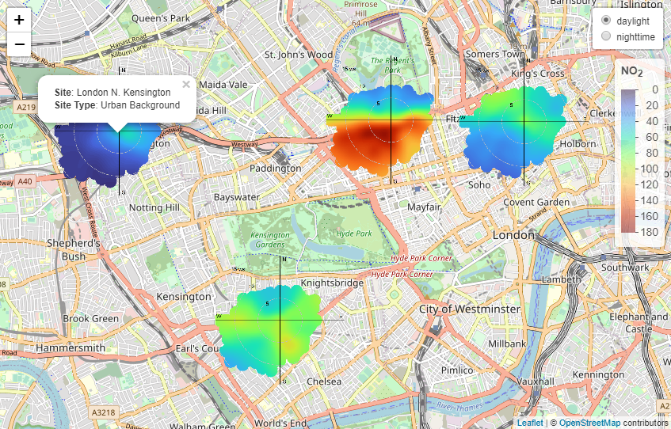

<!-- README.md is generated from README.Rmd. Please edit that file -->

# openairmaps: tools to create maps of air pollution data 

<!-- badges: start -->

[](https://github.com/davidcarslaw/openairmaps/actions/workflows/R-CMD-check.yaml)
[](https://CRAN.R-project.org/package=openairmaps)
<!-- badges: end -->

The main goal of `{openairmaps}` is to combine the robust analytical
methods found in [openair](https://davidcarslaw.github.io/openair/) with
the highly capable `{leaflet}` package. `{openairmaps}` is thoroughly
documented in the [openair
book](https://bookdown.org/david_carslaw/openair/sections/maps/maps-overview.html).

## Installation

You can install the release version of `{openairmaps}` from CRAN with:

``` r
install.packages("openairmaps")
```

You can install the development version of `{openairmaps}` from GitHub
with:

``` r
# install.packages("pak")
pak::pak("davidcarslaw/openairmaps")
```

## Overview

``` r
library(openairmaps)
```

The `openairmaps` package is thoroughly documented in the [openair
book](https://bookdown.org/david_carslaw/openair/sections/maps/maps-overview.html),
which goes into great detail about its various functions. Functionality
includes visualising UK AQ networks (`networkMap()`), putting “polar
directional markers” on maps (e.g., `polarMap()`) and overlaying HYSPLIT
trajectories on maps (e.g., `trajMap()`), all using the `{leaflet}`
package.

``` r
polar_data %>%
  openair::cutData("daylight") %>%
  buildPopup(
    c("site", "site_type"),
    names = c("Site" = "site", "Site Type" = "site_type"),
    control = "daylight"
  ) %>%
  polarMap(
    pollutant = "no2",
    limits = c(0, 180),
    control = "daylight",
    popup = "popup"
  )
```

<div class="figure">


<p class="caption">
An example `polarMap()` showing NO2 concentrations in central London.
</p>

</div>

While an interactive map is preferred for exploratory directional
analysis, it is limited to the HTML format. Some applications (for
example, academic journals) demand “static” formats like .docx and .pdf.
For this reason, “static” versions of `{openairmaps}` polar marker
functions have been provided which are written in `{ggplot2}`. A benefit
of being written in `{ggplot2}` is that additional layers can be added
(e.g., `geom_label()` could be used to label sites) and limited further
customisation is available using `theme()` and `guides()`.

Static maps require users to provide a
[ggmap](https://github.com/dkahle/ggmap) tileset, which at the time of
writing requires an API key for either Google or Stadia Maps.
