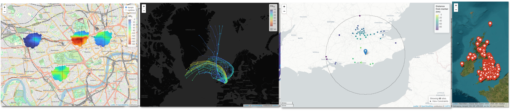

<div align="center">


## **openairmaps**
### open source tools to create maps of air pollution data

<!-- badges: start -->

[](https://github.com/davidcarslaw/openairmaps/actions)
[](https://CRAN.R-project.org/package=openairmaps)


[](https://github.com/davidcarslaw/openairmaps)
[](https://davidcarslaw.github.io/openairmaps)
[](https://bookdown.org/david_carslaw/openair/)
<!-- badges: end -->

</div>

**openairmaps** combines the robust analytical methods found in [**openair**](https://davidcarslaw.github.io/openair/) with a range of dynamic and static mapping capability. Core functionality includes visualising UK AQ networks (`networkMap()`), putting "polar directional markers" on maps (e.g., `polarMap()`) and overlaying HYSPLIT trajectories on maps (e.g., `trajMap()`), all using the `{leaflet}` package. Static equivalents of most functions are also available for insertion into traditional reports and academic articles.

<div align="center">

*Part of the openair toolkit*

[](https://davidcarslaw.github.io/openair) | 
[](https://davidcarslaw.github.io/worldmet) | 
[](https://davidcarslaw.github.io/openairmaps) | 
[](https://davidcarslaw.github.io/deweather)

</div>

<hr>

## 💡 Core Features

**openairmaps** has developed at pace to align **openair** with R's modern geospatial ecosystem.

- **Network visualisation** of many UK-based monitoring networks through `networkMap()`, all of which can also be searched using `searchNetwork()`.

- **Directional analysis maps** to place `openair::polarPlot()` and other "polar coordinate" plots on maps.

- **Trajectory analysis maps** (such as `trajMap()` and `trajLevelMap()`) for interactive implementations of the `openair::trajPlot()` family.

- **Flexible map conditioning** aligned with the **openair** `type` option to easily condition maps by season, day of the week, and so on.

- **Map building utilities** such as building popups for interactive maps, formatting common pollutant names and units, and converting UK postcodes to lat/lng coordinates.

<div align="center">

</div>

<hr>

## 📖 Documentation

All **openairmaps** functions are fully documented; access documentation using R in your IDE of choice.

```r
?openairmaps::polarMap
```

Documentation is also hosted online on the **package website**.

[](https://davidcarslaw.github.io/openairmaps)

A guide to the openair toolkit can be found in the **online book**, which contains lots of code snippets, demonstrations of functionality, and ideas for the application of **openair**'s various functions.

[](https://bookdown.org/david_carslaw/openair/)

<hr>

## 🗃️ Installation

**openairmaps** can be installed from **CRAN** with:

``` r
install.packages("openairmaps")
```

You can also install the development version of **openairmaps** from GitHub using `{pak}`:

``` r
# install.packages("pak")
pak::pak("davidcarslaw/openairmaps")
```

<hr>

🏛️ **openairmaps** is primarily maintained by [Jack Davison](https://github.com/jack-davison).

📃 **openairmaps** is licensed under the [GNU General Public License](https://davidcarslaw.github.io/openairmaps/LICENSE.html).

🧑‍💻 Contributions are welcome from the wider community. See the [contributing guide](https://davidcarslaw.github.io/openairmaps/CONTRIBUTING.html) and [code of conduct](https://davidcarslaw.github.io/openairmaps/CODE_OF_CONDUCT.html) for more information.
